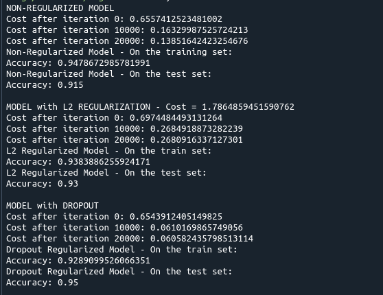
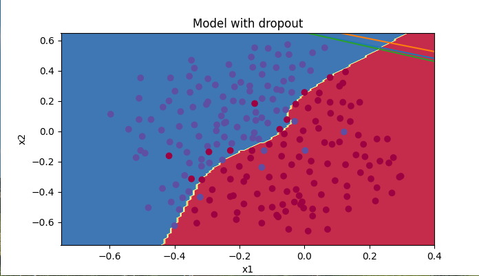

# Regularization

This repo contains the core deep neural network Regularization functions like L2, Dropout algorithms written in Python from scratch. 

reg_utils.py is a helper script and contains the Regularization functions and main.py is an example application script of these functions.

## Dependencies
* Python >= 3.9.13
    * Pip: [click here for installation instructions](https://pip.pypa.io/en/stable/installation/)

## Instructions

1. Clone the project repository.

2. Install the requirements: `pip install -r requirements.txt` 

3. Run the project: `python main.py`

4. The output should look like the following:

